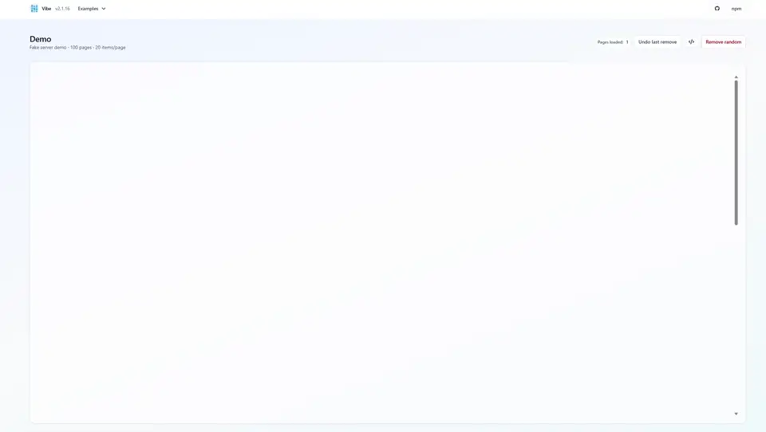

# VIBE — Vue Infinite Block Engine

[](https://www.npmjs.com/package/@wyxos/vibe)
[](https://opensource.org/licenses/MIT)
[](https://wyxos.github.io/vibe/)

A high-performance, responsive masonry layout engine for Vue 3 with built-in infinite scrolling and virtualization.

VIBE (Vue Infinite Block Engine) is designed for applications that need to display large datasets in a masonry grid without compromising performance. Unlike other masonry libraries, VIBE leverages virtualization to render only what is visible on the screen, ensuring smooth scrolling even with thousands of items.



---

## Features

- **High Performance Virtualization**: Efficiently renders thousands of items by only mounting elements currently in the viewport.
- **Responsive Masonry Layout**: Automatically adjusts column counts and layout based on screen width and breakpoints.
- **Mobile Swipe Feed**: Automatically switches to a vertical swipe feed on mobile devices for optimal mobile UX.
- **Infinite Scrolling**: Seamlessly loads more content as the user scrolls, with built-in support for async data fetching.
- **Dynamic Updates**: Supports adding, removing, and reflowing items with smooth FLIP animations.
- **Scroll Position Maintenance**: Keeps the user's scroll position stable when new items are loaded or the layout changes.
- **Built-in Item Component**: Includes a production-ready `MasonryItem` with lazy loading, image/video support, error handling, and hover effects.
- **Customizable Rendering**: Full control over item markup via scoped slots.

---

## Installation

```bash
npm install @wyxos/vibe
```

---

## Usage

### Basic Usage (Default Item)

By default, VIBE uses the built-in `MasonryItem` component, which handles image loading and provides a clean UI. On mobile devices (screen width < 768px by default), it automatically switches to a vertical swipe feed mode where users can swipe through items one at a time.

```vue
<script setup>
  import { ref } from 'vue'
  import { Masonry } from '@wyxos/vibe'

  const items = ref([])
  
  // Layout configuration
  const layout = {
    gutterX: 12,
    gutterY: 12,
    sizes: { base: 1, sm: 2, md: 3, lg: 4 }
  }

  async function getPage(page) {
    const response = await fetch(`/api/items?page=${page}`)
    const data = await response.json()
    // Items must have a 'src' property for the default MasonryItem
    // Optional: include 'type' ('image' or 'video') and 'notFound' (boolean)
    return {
      items: data.items,
      nextPage: page + 1
    }
  }
</script>

<template>
  <Masonry
      v-model:items="items"
      :get-page="getPage"
      :layout="layout"
      layout-mode="auto"
      :mobile-breakpoint="768"
  />
</template>
```

### Initialization Modes

VIBE supports two initialization modes:

- **`'auto'`**: Automatically calls `loadPage` on mount to fetch the first page. Use this when you want the component to start loading immediately.
- **`'manual'`**: Does nothing on mount. You must manually call `init()` to initialize the component with items. Use this when you need to restore items from saved state or have more control over when loading begins.

```vue
<!-- Auto mode: loads first page automatically -->
<Masonry
  v-model:items="items"
  :get-page="getPage"
  init="auto"
  :load-at-page="1"
/>

<!-- Manual mode: you control when to initialize -->
<Masonry
  ref="masonry"
  v-model:items="items"
  :get-page="getPage"
  init="manual"
/>
<script setup>
const masonry = ref(null)

// Later, initialize manually
masonry.value.items = []
masonry.value.init(savedItems, savedPage, savedNextPage)
</script>
```

### Layout Modes

VIBE supports three layout modes:

- **`'auto'`** (default): Automatically switches between masonry grid (desktop) and swipe feed (mobile) based on screen width
- **`'masonry'`**: Always use masonry grid layout regardless of screen size
- **`'swipe'`**: Always use swipe feed layout regardless of screen size

```vue
<!-- Force masonry layout on all devices -->
<Masonry layout-mode="masonry" ... />

<!-- Force swipe feed on all devices -->
<Masonry layout-mode="swipe" ... />

<!-- Custom breakpoint (use Tailwind breakpoint name) -->
<Masonry layout-mode="auto" mobile-breakpoint="lg" ... />

<!-- Custom breakpoint (use pixel value) -->
<Masonry layout-mode="auto" :mobile-breakpoint="1024" ... />
```

### Custom Item Rendering

You can fully customize the item rendering using the `#item` slot. You can also import and use `MasonryItem` inside the slot if you want to wrap it or extend it.

```vue
<script setup>
  import { Masonry, MasonryItem } from '@wyxos/vibe'
  // ... setup code ...
</script>

<template>
  <Masonry
      v-model:items="items"
      :get-page="getPage"
      :layout="layout"
  >
    <template #item="{ item, remove }">
      <!-- Custom container -->
      <div class="custom-card">
        <!-- You can use the built-in item or your own -->
        <MasonryItem :item="item" :remove="remove">
           <!-- Optional: MasonryItem also has a default slot for overlays -->
           <div class="absolute bottom-0 p-2 text-white">
             {{ item.title }}
           </div>
        </MasonryItem>
      </div>
    </template>
  </Masonry>
</template>
```

### Item Data Structure

Items can include the following properties:

```javascript
{
  id: 'unique-id',           // Required: unique identifier
  width: 300,                // Required: original width
  height: 200,               // Required: original height
  src: 'https://...',        // Required: media source URL
  type: 'image' | 'video',   // Optional: media type (defaults to 'image')
  notFound: false,           // Optional: show "Not Found" state
  // ... any other custom properties
}
```

### Slot Props

The `MasonryItem` component exposes the following props to its default slot:

- `item`: The item object
- `remove`: The remove callback function
- `imageLoaded`: Boolean indicating if image has loaded
- `imageError`: Boolean indicating if image failed to load
- `videoLoaded`: Boolean indicating if video has loaded
- `videoError`: Boolean indicating if video failed to load
- `showNotFound`: Boolean indicating if item is in "not found" state
- `isLoading`: Boolean indicating if media is currently loading
- `mediaType`: String indicating the media type ('image' or 'video')

---

## Props

| Prop | Type | Required | Description |
|------|------|----------|-------------|
| `items` | `Array` | Yes | Two-way bound item array. Each item must include `width`, `height`, and `id`. |
| `getPage` | `Function(page: Number)` | Yes | Async function to load a page. Must return `{ items, nextPage }`. |
| `layout` | `Object` | No | Configuration object for layout, including sizes and gutters. |
| `loadAtPage` | `Number` | No | The starting page number (default: `1`). |
| `init` | `String` | No | Initialization mode: `'auto'` (automatically loads first page on mount) or `'manual'` (user must call `init()` manually) (default: `'manual'`). |
| `paginationType` | `String` | No | `'page'` or `'cursor'` (default: `'page'`). |
| `pageSize` | `Number` | No | Number of items per page, used for backfilling (default: `40`). |
| `layoutMode` | `String` | No | Layout mode: `'auto'` (detect from screen size), `'masonry'`, or `'swipe'` (default: `'auto'`). |
| `mobileBreakpoint` | `Number \| String` | No | Breakpoint for switching to swipe mode in pixels or Tailwind breakpoint name (default: `768`). |

### Layout Configuration Example

```js
{
  gutterX: 10,
  gutterY: 10,
  sizes: {
    base: 1,
    sm: 2,
    md: 3,
    lg: 4,
    xl: 5,
    '2xl': 6
  }
}
```

---

## MasonryItem Component

The built-in `MasonryItem` component is available for use within the `#item` slot or as a standalone component. It provides intelligent lazy loading, media type detection, and comprehensive error handling.

### Props

| Prop | Type | Description |
|------|------|-------------|
| `item` | `Object` | The item object. Must contain `src` for media loading. Can include `type` (`'image'` or `'video'`), `notFound` (boolean), and other custom properties. |
| `remove` | `Function` | Optional callback to remove the item. If provided, a remove button is shown on hover. |
| `type` | `'image' \| 'video'` | Optional. Overrides `item.type`. Defaults to `'image'`. |
| `notFound` | `Boolean` | Optional. Overrides `item.notFound`. When `true`, displays a "Not Found" state instead of loading media. |

### Features

- **Lazy Loading with Intersection Observer**: Only starts preloading media when the item comes into view (50%+ visible), significantly improving initial page load performance.
- **Image & Video Support**: Automatically handles both images and videos with appropriate loading strategies.
- **Media Type Indicator**: Shows a badge icon (image/video) on hover to indicate the media type.
- **Smart Spinner**: Displays a loading spinner underneath the media (not covering it) during preload.
- **Error Handling**: Displays user-friendly error states if media fails to load.
- **Not Found State**: Special visual state for items that cannot be located.
- **Hover Effects**: Includes subtle zoom, overlay gradient, and smooth transitions.
- **Performance Optimized**: Properly cleans up Intersection Observers to prevent memory leaks.

---

## Slots

| Slot Name | Props | Description |
|-----------|-------|-------------|
| `item` | `{ item, remove }` | Scoped slot for custom rendering of each masonry block. |

---

## Run Locally

To run the demo project locally:

```bash
git clone https://github.com/wyxos/vibe
cd vibe
npm install
npm run dev
```

Visit `http://localhost:5173` to view the demo.

---

## Live Demo

[View Live Demo on GitHub Pages](https://wyxos.github.io/vibe/)

---

## License

MIT © [@wyxos](https://github.com/wyxos)
